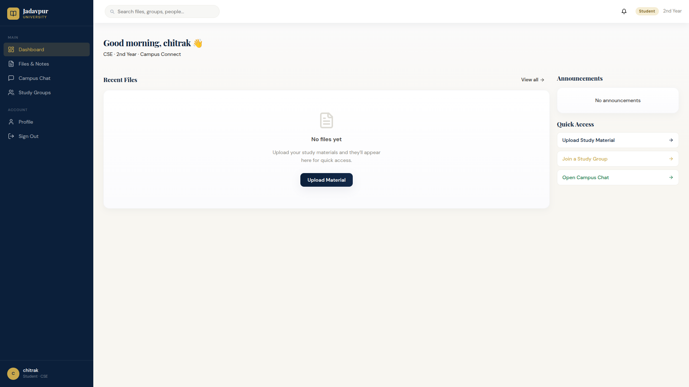
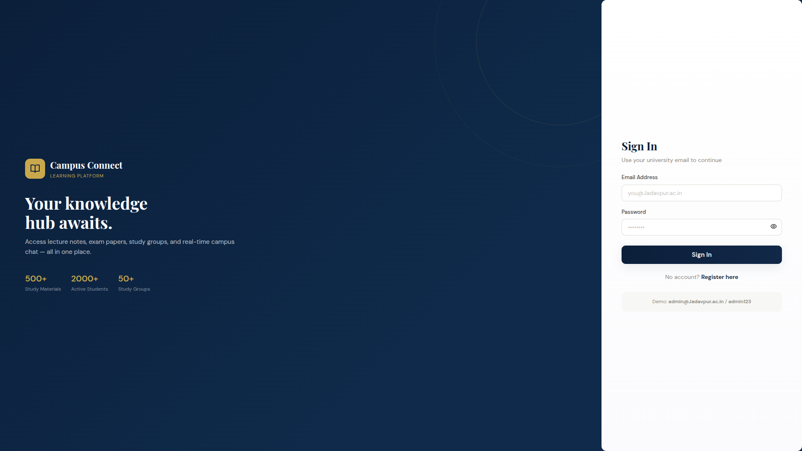
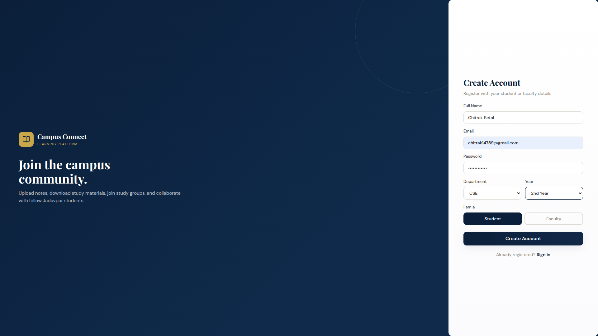
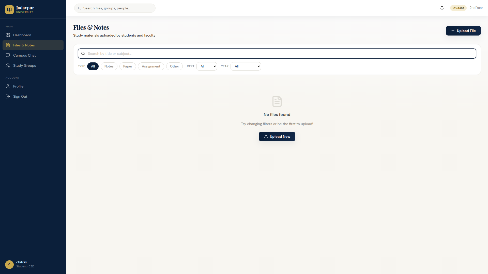
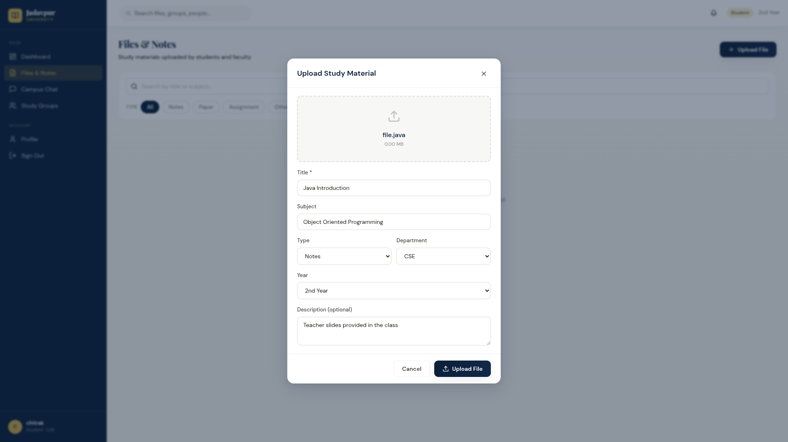
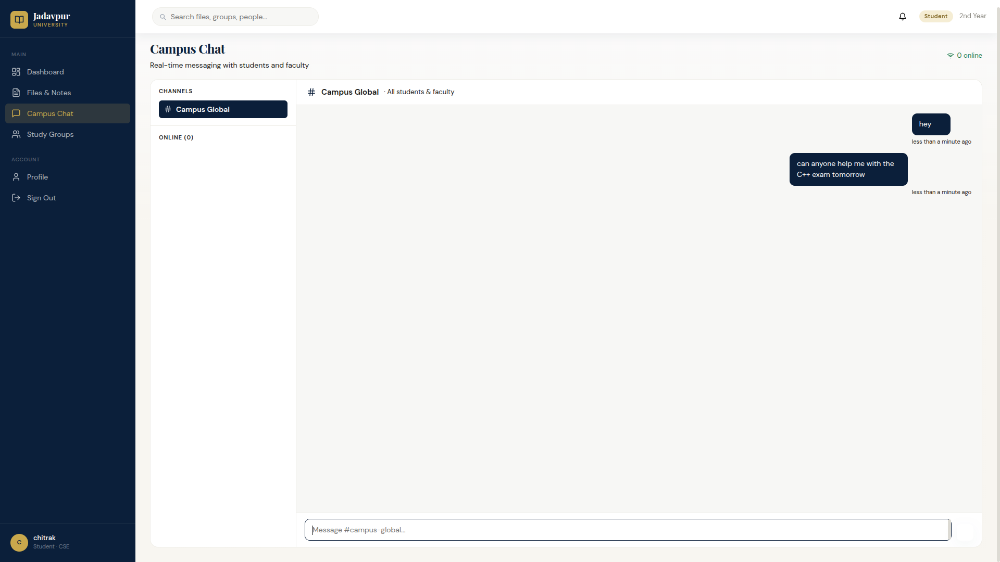
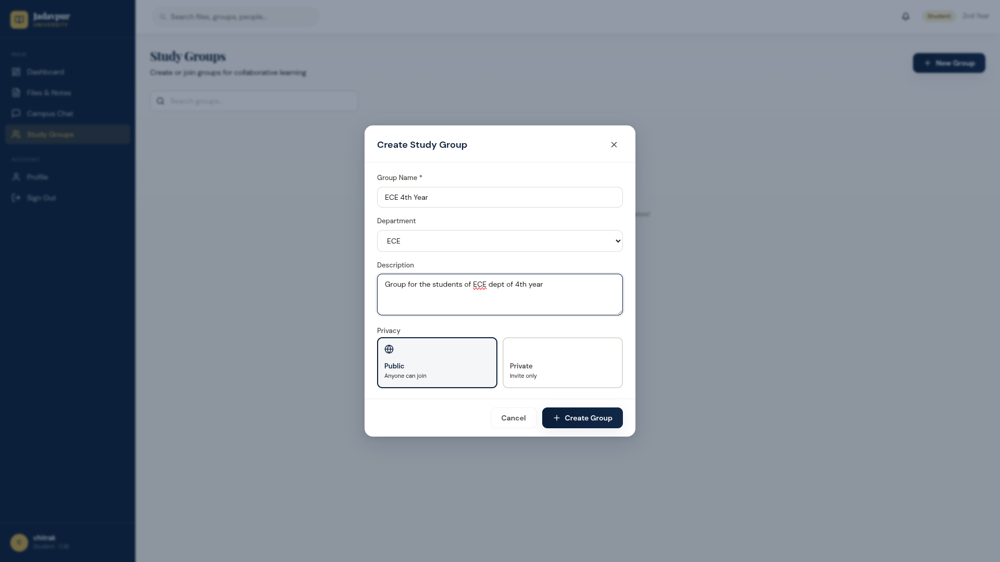
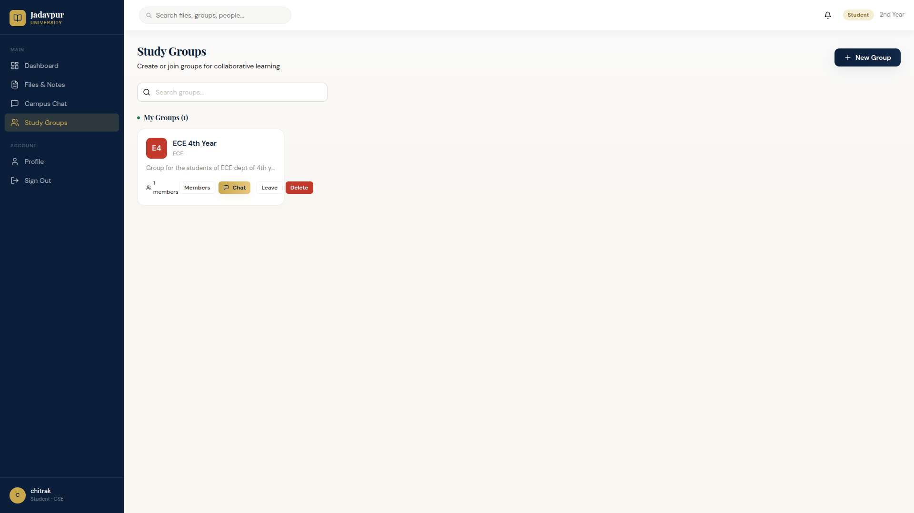
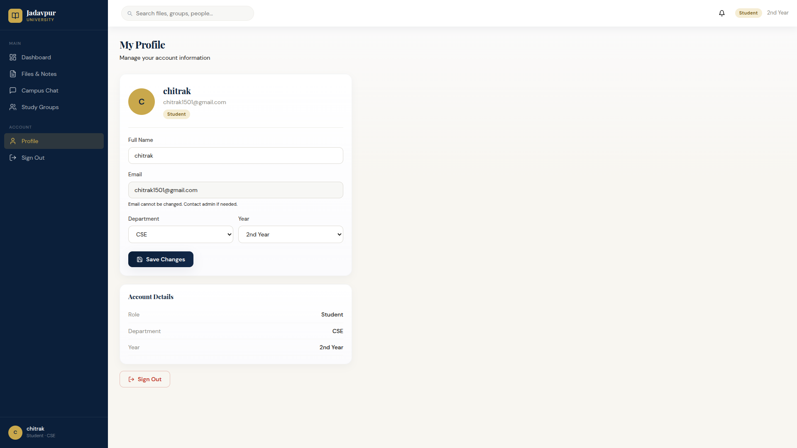

# 🎓 Campus Connect

<p align="center">
  
</p>

<p align="center">
A full-stack campus collaboration platform built with <b>React</b>, <b>Node.js</b>, <b>Express</b>, <b>PostgreSQL</b>, <b>Socket.IO</b>, and <b>Cloudinary</b>.
</p>

<p align="center">


</p>

---

# ✨ Features

- 🔐 Secure JWT Authentication
- 👨‍🎓 Student & Faculty Accounts
- 📚 Study Material Upload & Download
- ☁️ Cloudinary File Storage
- 📧 Email OTP Verification
- 💬 Real-Time Chat (Socket.IO)
- 👥 Study Groups
- 📢 Announcements
- 🛠 Admin Dashboard
- 👤 Profile Management
- 🚀 Fully Deployed on Vercel & Render
- 📊 PostgreSQL Database

---

# 🛠 Tech Stack

| Category | Technologies |
|-----------|-------------|
| Frontend | React, Vite, React Router |
| Backend | Node.js, Express.js |
| Database | PostgreSQL (Neon) |
| Authentication | JWT, bcryptjs |
| Real-time | Socket.IO |
| Storage | Cloudinary |
| Styling | CSS |

---

# 🏛 Architecture

```
                User
                  │
                  ▼
        React + Vite (Vercel)
                  │
         REST API + Socket.IO
                  │
                  ▼
       Express.js Backend (Render)
          ┌────────┴────────┐
          ▼                 ▼
   PostgreSQL          Cloudinary
      (Neon)           File Storage
          │
          ▼
     Gmail SMTP
     OTP Verification
```


# 📸 Application Screenshots

## Authentication

<p align="center">





</p>

---

## Dashboard

<p align="center">


</p>

---

## Files & Uploads

<p align="center">





</p>

---

## Real-Time Chat

<p align="center">



</p>

---

## Study Groups

<p align="center">





</p>

---

## Profile

<p align="center">



</p>

---

# 🏗 Project Structure

```text
Campus-Connect/
│
├── backend/
│   │
│   ├── config/
│   │   ├── cloudinary.js
│   │   └── db.js
│   │
│   ├── controllers/
│   │   ├── adminController.js
│   │   ├── authController.js
│   │   ├── fileController.js
│   │   ├── groupController.js
│   │   └── messageController.js
│   │
│   ├── middleware/
│   │   └── auth.js
│   │
│   ├── routes/
│   │   ├── admin.js
│   │   ├── auth.js
│   │   ├── files.js
│   │   ├── groups.js
│   │   └── messages.js
│   │
│   ├── node_modules/
│   │
│   ├── .env
│   ├── .gitignore
│   ├── package.json
│   ├── package-lock.json
│   ├── seed.js
│   └── server.js
│
├── frontend/
│   │
│   ├── node_modules/
│   │
│   ├── public/
│   │   └── favicon.svg
│   │
│   ├── src/
│   │   │
│   │   ├── components/
│   │   │   └── Layout.jsx
│   │   │
│   │   ├── context/
│   │   │   └── AuthContext.jsx
│   │   │
│   │   ├── pages/
│   │   │   ├── AdminPage.jsx
│   │   │   ├── ChatPage.jsx
│   │   │   ├── Dashboard.jsx
│   │   │   ├── FilesPage.jsx
│   │   │   ├── GroupsPage.jsx
│   │   │   ├── LoginPage.jsx
│   │   │   ├── ProfilePage.jsx
│   │   │   └── RegisterPage.jsx
│   │   │
│   │   ├── utils/
│   │   │   ├── api.js
│   │   │   ├── socket.js
│   │   │   └── tabSession.js
│   │   │
│   │   ├── App.jsx
│   │   ├── index.css
│   │   └── main.jsx
│   │
│   ├── .env
│   ├── .gitignore
│   ├── index.html
│   ├── package.json
│   ├── package-lock.json
│   └── vite.config.js
│
├── README-assets/
│   ├── chat.png
│   ├── create_group.png
│   ├── dashboard.png
│   ├── files.png
│   ├── group.png
│   ├── login.png
│   ├── profile.png
│   ├── register.png
│   └── upload.png
│
├── .git/
│
└── README.md
```

---

# 🚀 Getting Started

## Clone Repository

```bash
git clone https://github.com/chitrak-cs/Collage-Connect.git
```

```bash
cd Collage-Connect
```

---

## Backend

```bash
cd backend
npm install
cp .env.example .env
npm run dev
```

Runs on

```
http://localhost:5001
```

---

## Frontend

```bash
cd frontend
npm install
npm run dev
```

Runs on

```
http://localhost:5173
```

---

# 🔑 Environment Variables

```env
PORT=

DATABASE_URI=

JWT_SECRET=

JWT_EXPIRES_IN=

CLOUDINARY_CLOUD_NAME=

CLOUDINARY_API_KEY=

CLOUDINARY_API_SECRET=

CLIENT_URL=
```

---

# 📡 REST API

| Method | Endpoint | Description |
|---------|----------|-------------|
| POST | /api/auth/login | Login |
| POST | /api/auth/register | Register |
| GET | /api/files | Files |
| POST | /api/files/upload | Upload |
| GET | /api/groups | Groups |
| GET | /api/messages/global | Chat |
| GET | /api/admin/stats | Admin |

---

# 💡 Skills Demonstrated

- Authentication
- REST APIs
- PostgreSQL
- Database Design
- CRUD Operations
- WebSockets
- Cloudinary Integration
- Role Based Authorization
- Responsive UI
- React Context API
- Express Middleware
- File Upload Handling
- Production Deployment
- Environment Variable Management
- Cloud Hosting (Render & Vercel)
- SMTP Email Integration

---

# 🔮 Future Improvements

- Push Notifications
- PDF Preview
- Dark Mode
- Search
- AI Study Assistant
- Mobile App
- Video Calling

---

# ☁️ Deployment

The application is fully deployed in production using modern cloud services.

| Service | Platform |
|----------|----------|
| 🌐 Frontend Hosting | **Vercel** |
| ⚙️ Backend Hosting | **Render** |
| 🗄 Database | **Neon PostgreSQL** |
| ☁️ File Storage | **Cloudinary** |
| 📧 Email Service | **Gmail SMTP (Nodemailer)** |

### Deployment Architecture

```
React (Vercel)
       │
       ▼
Express + Socket.IO (Render)
       │
 ┌─────┴────────┐
 ▼              ▼
Neon DB    Cloudinary
       │
       ▼
 Gmail SMTP
```


---

# 👨‍💻 Author

**Chitrak Betal**

GitHub

```
https://github.com/chitrak-cs
```

LinkedIn

```
https://www.linkedin.com/in/chitrak-betal-a5398431a/?skipRedirect=true
```

---

# ⭐ If you like this project

Give it a ⭐ on GitHub.